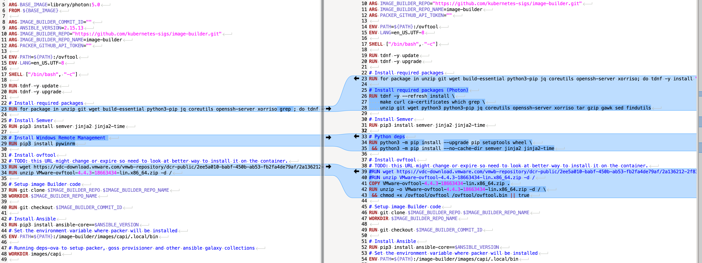

# vsphere-tanzu-kubernetes-grid-image-builder-ovftool-offline

Install OVF Tool offline + Dockerfile patch.



## Problem

The build fails because OVF Tool URL hardcoded in the Dockerfile is ephemeral/protected, so wget returns a non-zero exit code during docker build.

```bash
Dockerfile:33
--------------------
  31 |     # Install ovftool
  32 |     # TODO: this URL might change or expire so need to look at better way to install it on the container.
  33 | >>> RUN wget https://vdc-download.vmware.com/vmwb-repository/dcr-public/2ee5a010-babf-450b-ab53-fb2fa4de79af/2a136212-2f83-4f5d-a419-232f34dc08cf/VMware-ovftool-4.4.3-18663434-lin.x86_64.zip
  34 |     RUN unzip VMware-ovftool-4.4.3-18663434-lin.x86_64.zip -d /
  35 |
--------------------
ERROR: failed to solve: process "/bin/bash -c wget https://vdc-download.vmware.com/vmwb-repository/dcr-public/2ee5a010-babf-450b-ab53-fb2fa4de79af/2a136212-2f83-4f5d-a419-232f34dc08cf/VMware-ovftool-4.4.3-18663434-lin.x86_64.zip" did not complete successfully: exit code: 6
make: *** [Makefile:75: build-image-builder-container] Error 1
```

## Resolution 

1 : Download [OVF Tool 4.4.3 for Linux 64-bit](https://developer.broadcom.com/tools/open-virtualization-format-ovf-tool/4.4.3).

You will get **VMware-ovftool-4.4.3-18663434-lin.x86_64.bundle**.

2 : Clone [vsphere-tanzu-kubernetes-grid-image-builder](https://github.com/vmware-tanzu/vsphere-tanzu-kubernetes-grid-image-builder) locally.
>> This procedure works with the latest release v1.27.16+vmware.2-fips-vkr.2 and has also been tested with the older v0.7.0

3 : Once cloned, place **VMware-ovftool-4.4.3-18663434-lin.x86_64.bundle** at the same level as the base **Dockerfile**.

4 : Perform the following operations on the .bundle :

```bash
chmod +x VMware-ovftool-4.4.3-18663434-lin.x86_64.bundle
./VMware-ovftool-4.4.3-18663434-lin.x86_64.bundle --extract ovfextract
cp -a ovfextract/vmware-ovftool ./ovftool
python3 -m zipfile -c VMware-ovftool-4.4.3-18663434-lin.x86_64.zip ovftool
```

5 : Configure the vCenter details in **packer-variables/vsphere.j2**.

6 : (optional) Create modification for the future image (increase disk size) in **packer-variables/custom.j2**.

```bash
{
  "disk_size": "61440"
}
```

7 : Run the artifacts container with the TKR version referenced in **supported-version.txt/.json** or **supported-context.json/.txt** : 

```bash
    make run-artifacts-container KUBERNETES_VERSION=v1.30.1+vmware.1-fips
```

8 : Replace the contents of the base Dockerfile with the one from this project : [Dockerfile-ovftool-offline](./Dockerfile-ovftool-offline).

9 : Run the image-builder container to build the node image, making sure to reference the correct **OS_TARGET** in **supported-version.txt/.json** or **supported-context.json/.txt** : 

**For Photon**

```bash
make build-node-image OS_TARGET=photon-5 KUBERNETES_VERSION=v1.30.1+vmware.1-fips TKR_SUFFIX=pho-vmdk60 HOST_IP=XXX.XXX.XXX.XXX IMAGE_ARTIFACTS_PATH=/docker/image ARTIFACTS_CONTAINER_PORT=8081 PACKER_HTTP_PORT=8082
```
>> IMAGE_ARTIFACTS_PATH=/docker/image : point this to a directory with plenty of free space.

**For Ubuntu 22.04 EFI** 

```bash
make build-node-image OS_TARGET=ubuntu-2204-efi KUBERNETES_VERSION=v1.30.1+vmware.1-fips TKR_SUFFIX=ubu-vmdk60 HOST_IP=XXX.XXX.XXX.XXX IMAGE_ARTIFACTS_PATH=/docker/image ARTIFACTS_CONTAINER_PORT=8081 PACKER_HTTP_PORT=8082
```
>> IMAGE_ARTIFACTS_PATH=/docker/image : point this to a directory with plenty of free space.

10 : Once the OVA is generated upload the OVA to a content library used by the supervisor.

## Note
I’ve observed an intermittent failure (~1/10) on the “Set up carvel tools inside OVA” Ansible task (Carvel/kctrl download) due to transient GitHub asset fetches -> simply re-running the build usually succeeds.